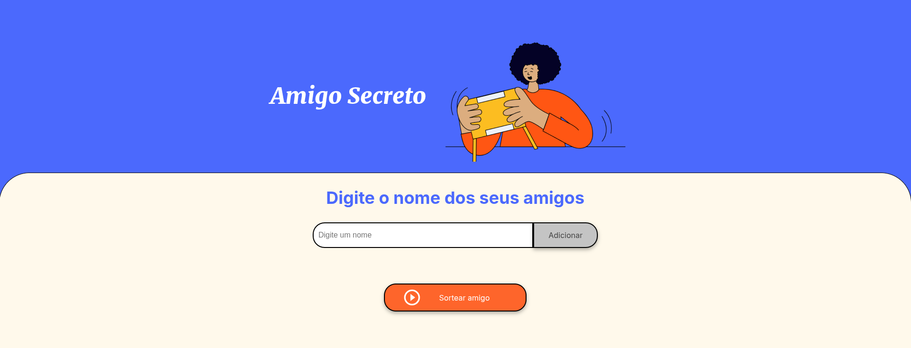
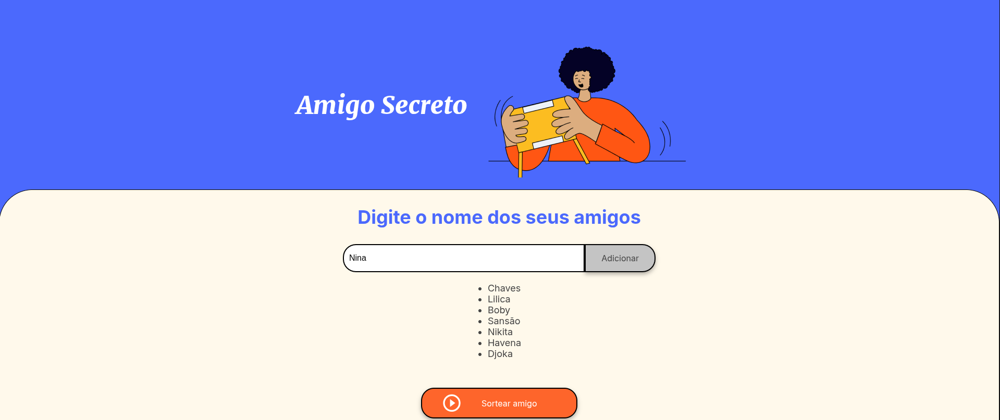
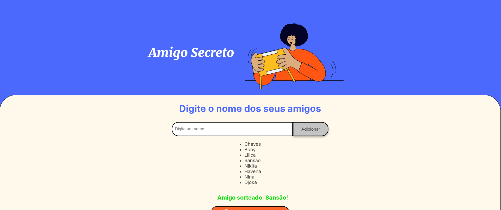

# Amigo Secreto 🎁  

Este é um projeto simples de **Amigo Secreto** desenvolvido em JavaScript. Ele permite adicionar nomes a uma lista e realizar o sorteio de um amigo secreto de forma aleatória.  

## 📌 Funcionalidades

✅ Adicionar nomes de participantes.  
✅ Listar todos os participantes.  
✅ Realizar o sorteio de um amigo secreto.  
✅ Exibir o nome sorteado.  

## 📸 Capturas de Tela  
- **Interface Principal** 
 
- **Adicionando Participantes** 
 
- **Sorteio Realizado**  


## 🚀 Como Usar  
1. Digite um nome no campo de entrada.  
2. Clique no botão **"Adicionar"** para inserir o participante na lista.  
3. Repita o processo para adicionar mais participantes.  
4. Clique em **"Sortear"** para escolher aleatoriamente um dos nomes adicionados.  
5. O nome sorteado será exibido na tela.  

## 🛠️ Tecnologias Utilizadas  
- **HTML**  

- **CSS**   

- **JavaScript**  


## ⚙️ Como Executar o Projeto  
1. Clone este repositório:  
   ```sh
   git clone https://github.com/seu-usuario/amigo-secreto.git 
2. Abra o arquivo `index.html` no navegador.

## 🔗 Contribuição

Se desejar contribuir com melhorias, faça um fork deste repositório, crie uma branch, implemente suas melhorias e envie um pull request.

## 📃 Licença

Este projeto está sob a licença MIT. Para mais informações, consulte o arquivo `LICENSE`.
